 	FORMATO DE INFORME DE PRÁCTICA DE LABORATORIO / TALLERES / CENTROS DE SIMULACIÓN – PARA ESTUDIANTES

CARRERA:computacion	ASIGNATURA:programación hipermedial
NRO. PRÁCTICA:	1	TÍTULO PRÁCTICA: php

 OBJETIVO 
• Entender y organizar de una mejor manera los sitios de web en Internet 
• Diseñar adecuadamente elementos gráficos en sitios web en Internet. 
• Crear sitios web aplicando estándares actuales. 

 Con base al archivo PHP (Apuntes y ejercicios), se pide realizar los siguientes ajustes: 
	a) Agregar roles a la tabla usuario. Un usuario puede tener un rol de “admin” o “user” 
	b) Los usuarios con rol de “admin” pueden: modificar, eliminar y cambiar la contraseña de cualquier usuario de la base de datos. 
	c) Los usuarios con rol de “user” pueden modificar, eliminar y cambiar la contraseña de su usuario. 

Luego, con base a estos ajustes realizados, se pide desarrollar una aplicación web usando PHP y Base de Datos que permita gestionar reuniones entre usuarios de la aplicación. De las reuniones se desea conocer la fecha y hora, lugar, coordenadas (latitud y longitud) remitente (quien invita), invitados (quienes asisten), motivo de la reunión y observaciones. 
Para lo cuál, se pide como mínimo los siguientes requerimientos: 
Usuario con rol de user: 
	d) Visualizar en su pagina principal (index.php) el listado de todas las reuniones agendadas, ordenados por las más recientes. 
	e) Crear reuniones e invitar a otros usuarios de la aplicación web. 
	f) Buscar en las reuniones agendadas. La búsqueda se realizará por el motivo de la reunión y se deberá aplicar Ajax para la búsqueda. 
	g) Modificar los datos del usuario. 
	h) Cambiar la contraseña del usuario. 

Usuario con rol de admin: 
	i) No puede recibir ni invitar a reuniones. 
	j) Visualizar en su pagina principal (index.php) el listado de todas las reuniones existentes, ordenados por los más recientes. 
	k) Eliminar las reuniones de los usuarios con rol “user”. 
	l) Eliminar, modificar y cambiar contraseña de los usuarios con rol “user”. 

 Por último, se debe aplicar parámetros de seguridad a través del uso de sesiones. Para lo cuál, se debe tener en cuenta: 
	m) Un usuario “anónimo”, es decir, un usuario que no ha iniciado sesión puede acceder únicamente a los archivos de la carpeta pública. 

	n) Un usuario con rol de “admin” puede acceder únicamente a los archivos de la carpeta admin → vista → admin y admin → controladores → admin 
	o) Un usuario con rol de “user” puede acceder únicamente a los archivos de la carpeta admin → vista → user y admin → controladores → user 
	

 ACTIVIDADES DESARROLLADAS

1. Generar el diagrama E-R para la solución de la práctica 
 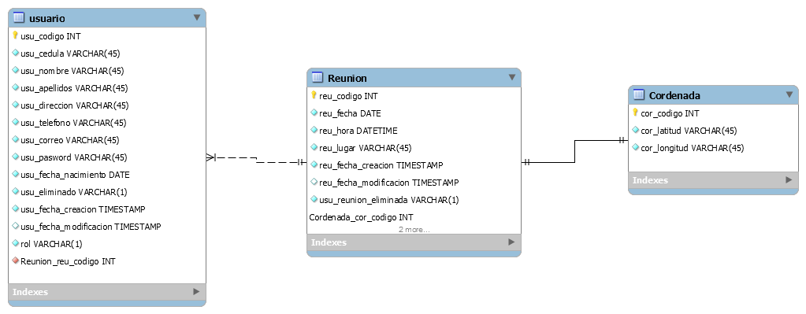

2. Crear un repositorio en GitHub con el nombre “Practica04 – Mi Correo Electrónico” 
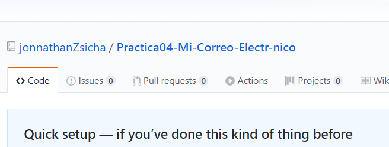
 

3. Realizar un commit y push por cada requerimiento de los puntos antes descritos. 
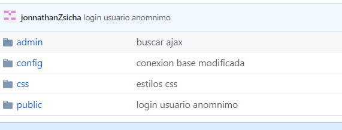
 

	b. Nombre de la base de datos 
	
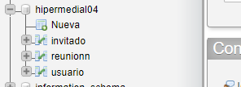
 

	Sentencias SQL de la estructura de la base de datos 
	
CREATE TABLE `usuario` (
  `usu_codigo` int(11) NOT NULL,
  `usu_cedula` varchar(10) NOT NULL,
  `usu_nombres` varchar(50) NOT NULL,
  `usu_apellidos` varchar(50) NOT NULL,
  `usu_direccion` varchar(75) NOT NULL,
  `usu_telefono` varchar(20) NOT NULL,
  `usu_correo` varchar(20) NOT NULL,
  `usu_password` varchar(255) NOT NULL,
  `usu_fecha_nacimiento` date NOT NULL,
  `usu_eliminado` varchar(1) NOT NULL DEFAULT 'N',
  `usu_fecha_creacion` timestamp NOT NULL DEFAULT current_timestamp(),
  `usu_fecha_modificacion` timestamp NULL DEFAULT NULL,
  `usu_rol` varchar(10) NOT NULL DEFAULT 'user'
) 

CREATE TABLE `reunionn` (
  `reu_codigo` int(11) NOT NULL,
  `reu_lugar` varchar(20) NOT NULL,
  `reu_fecha` date NOT NULL,
  `reu_hora` time NOT NULL,
  `reu_motivo` varchar(100) NOT NULL,
  `reu_observacaion` varchar(50) NOT NULL,
  `reu_latitud` varchar(50) NOT NULL,
  `reu_longitud` varchar(50) NOT NULL,
  `reu_eliminada` varchar(1) NOT NULL DEFAULT 'N',
  `reu_fecha_modificacion` timestamp NULL DEFAULT NULL,
  `reu_fecha_creacion` timestamp NOT NULL DEFAULT current_timestamp(),
  `reu_remitente` int(11) NOT NULL
)

CREATE TABLE `invitado` (
  `inv_codigo` int(11) NOT NULL,
  `inv_usuario` int(11) NOT NULL,
  `inv_reunion` int(11) NOT NULL
)

	5.

	d. El desarrollo de cada uno de los requerimientos antes descritos. 
	usuario anonimo
	
 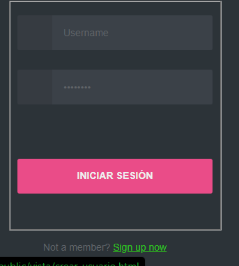

	 acceso del usuario admin
	  	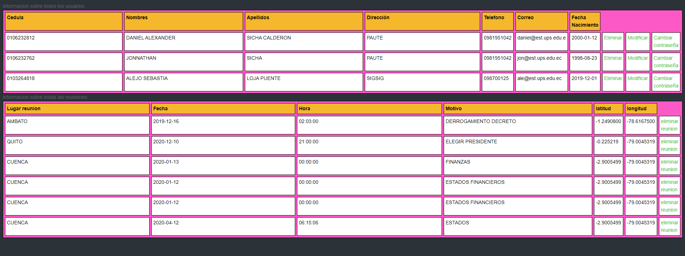
	
Eliminar un usuario
 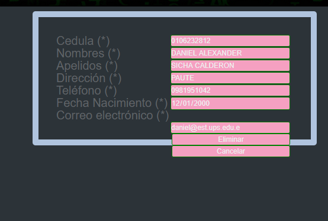
Modificar un usuario
	 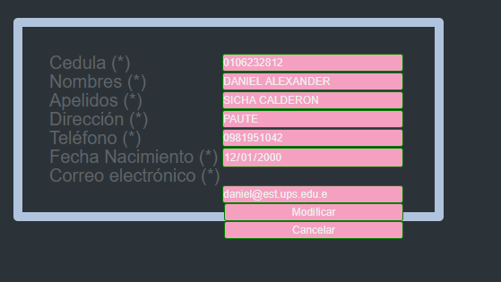
	cambiar contraseña usuario
	 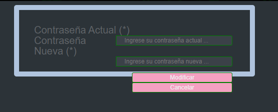
	acceso user
	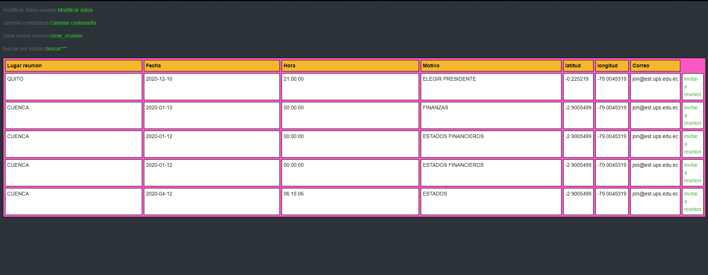
	 

	eliminar una reunion
	 
	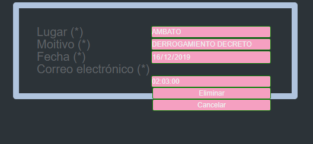
Buscar por ajax
 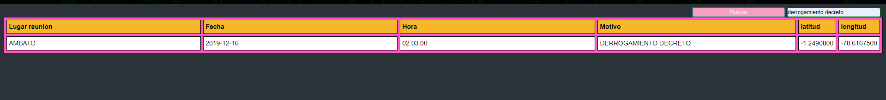

Crear una reunion
 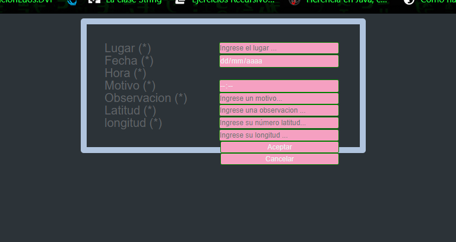
Invitar a una reunion
 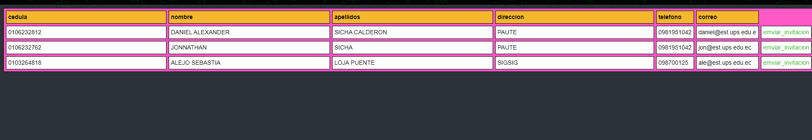

	
RESULTADO(S) OBTENIDO(S):

usuario y URL del repositorio de la práctica04: https://github.com/jonnathanZsicha/Practica04-Mi-Correo-Electr-nico.git 

CONCLUSIONES: con la presente practica se ha logrado en el uso html de una manera optima junto con sus css de esta manera entender de mejor manera su estructura validándola y dándonos cuenta de como esta debe estar correctamente estructurada el código html y darle formatos de estilos mediante css.y php junto con Ajax su funcionamiento es optimo.
RECOMENDACIONES: se debe conocer o investigar todas las características que le podemos poner a nuestros paginas pudiendo optimizarla al 100 % dependiendo el aspecto que deseemos.

Nombre de estudiante:  Jonnathan Sicha

Firma de estudiante: _______________________________
